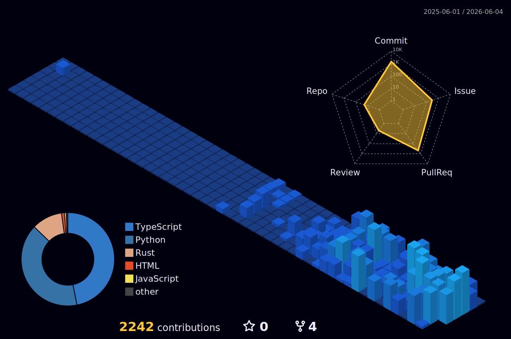

<!-- ═══════════════════════════════════════════════════════════════════════════════════════ -->
<!-- ║                 M Y T H O L O G I Q   ·   K E V I N   K N A P P                        ║ -->
<!-- ║                 GitHub Profile · Monolith Ledger Edition                                ║ -->
<!-- ═══════════════════════════════════════════════════════════════════════════════════════ -->

<div align="center">

  

  <h1>Kevin Knapp</h1>

  

  <br><br>

  
  
  

</div>

```text
MYTHOLOGIQ // GOVERNANCE OPERATOR
operator   Kevin Knapp
role       Agent Governance Architect
focus      deterministic policy · zero-trust identity · verifiable audit
building   FailSafe · FailSafe Pro · agent-governance-toolkit (maintainer)
doctrine   deny by default · provenance over phrasing · every decision leaves a trail
```

---

### THE WORK

I build the security layer for autonomous AI agents: deterministic policy enforcement,
zero-trust identity, execution isolation, and a tamper-evident record of everything an
agent does. The goal is easy to state and hard to engineer. Let agents act on their own,
inside boundaries they cannot quietly cross, with a trail you can verify after the fact.

### DOCTRINE

1. **Deny by default.** Trust is earned per action, not granted per session.
2. **Provenance over phrasing.** A decision turns on where an instruction came from, not how it is worded.
3. **Every decision leaves a verifiable trail.** Audit is structural, not optional.
4. **Governance adapts to the system, not the reverse.**
5. **Autonomy without accountability is just unmonitored risk.**

---

<div align="center">

### CAPABILITIES

</div>

<table align="center">
  <tr>
    <td align="center" width="33%">
      <br>
      <sub>deterministic verdicts · ALLOW / DENY / AUDIT / BLOCK</sub>
    </td>
    <td align="center" width="33%">
      <br>
      <sub>Ed25519 · SPIFFE · DID · trust scoring</sub>
    </td>
    <td align="center" width="33%">
      <br>
      <sub>privilege rings · kill switch · sandboxing</sub>
    </td>
  </tr>
  <tr>
    <td align="center" width="33%">
      <br>
      <sub>SLOs · error budgets · circuit breakers</sub>
    </td>
    <td align="center" width="33%">
      <br>
      <sub>QoreLogic · S.H.I.E.L.D. lifecycle · L1/L2/L3</sub>
    </td>
    <td align="center" width="33%">
      <br>
      <sub>Merkle / HMAC hash-chains · verifiable</sub>
    </td>
  </tr>
</table>

---

### SELECTED WORK

| Project | What it is |
| --- | --- |
| **[agent-governance-toolkit](https://github.com/microsoft/agent-governance-toolkit)** | Microsoft's open governance toolkit for autonomous agents. Maintainer / contributor. |
| **[FailSafe](https://github.com/MythologIQ-Labs-LLC/FailSafe)** | MythologIQ's deterministic governance layer. Shadow Genome, gated SDLC, verifiable ledger. |
| **[Qor](https://github.com/Knapp-Kevin/Qor)** | Qor-Logic: agentic gated-SDLC governance. Plan, audit, implement, validate. |
| **[bicameral-mcp](https://github.com/Knapp-Kevin/bicameral-mcp)** | Decision-ledger MCP server. Maps decisions to code and tracks drift. |

<div align="center">

<table>
  <tr>
    <td width="50%">
      <a href="https://github.com/microsoft/agent-governance-toolkit">
        
      </a>
    </td>
    <td width="50%">
      <a href="https://github.com/MythologIQ-Labs-LLC/FailSafe">
        
      </a>
    </td>
  </tr>
  <tr>
    <td width="50%">
      <a href="https://github.com/Knapp-Kevin/Qor">
        
      </a>
    </td>
    <td width="50%">
      <a href="https://github.com/Knapp-Kevin/bicameral-mcp">
        
      </a>
    </td>
  </tr>
</table>

<!-- Add the rest of the bicameral tree (bot, integrations) once public: copy a <td> block and swap username/repo. -->

</div>

---

<div align="center">

### ACTIVITY

<table>
  <tr>
    <td width="50%" align="center">
      
    </td>
    <td width="50%" align="center">
      
    </td>
  </tr>
</table>


<!-- Rendered by the lowlighter/metrics workflow (.github/workflows/metrics.yml).
     Add a METRICS_TOKEN secret (classic PAT: public_repo, read:user, read:org),
     run the Metrics workflow once, then UNCOMMENT the line below.

-->


<!-- Rendered by the 3d-contrib workflow (.github/workflows/3d-contrib.yml). 404s until the first run. -->


</div>

---

<div align="center">

### TOOLSET

</div>

**Languages**
&nbsp;


**Agents & AI**
&nbsp;


**Build & Runtime**
&nbsp;


**Infra & Data**
&nbsp;


---

<div align="center">

### CONNECT

[](https://www.linkedin.com/in/kevin-r-knapp/)
[](https://www.linkedin.com/company/mythologiq/)
[](https://www.linkedin.com/company/bicameral-ai/)
[](https://x.com/mythologiq)
[](mailto:krknapp@gmail.com)

<br>


</div>

---

<div align="center">
  <sub><b>MythologIQ</b> · governed agents, verifiable trails · "Autonomy without accountability is just unmonitored risk."</sub>
</div>
