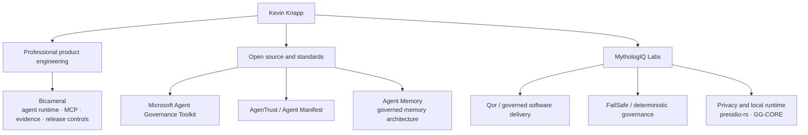

# Kevin Knapp

**Lead AI Product Engineer · Agent Governance Architect · Open-Source Standards Contributor**

[Bicameral](https://www.linkedin.com/company/bicameral-ai/) · [MythologIQ Labs](https://www.linkedin.com/company/mythologiq/) · [Microsoft Agent Governance Toolkit](https://github.com/microsoft/agent-governance-toolkit) · [AgenTrust](https://github.com/agentrust-io)

> **Governance by prompt is not real governance.** Reliable agent systems need explicit authority, deterministic enforcement where consequences matter, durable provenance, and evidence that survives the model that produced it.

## What I build

I work on trustworthy autonomous-agent systems and the infrastructure around them: policy enforcement, authority and identity boundaries, governed memory, persistent state, MCP-mediated workflows, privacy, local-first execution, adversarial validation, and evidence-bound release controls.

My work is easiest to understand as three connected lanes:

```mermaid
flowchart TB
    K["Kevin Knapp"]

    K --> P["Professional product engineering"]
    K --> O["Open source and standards"]
    K --> M["MythologIQ Labs"]

    P --> B["Bicameral\nagent runtime · MCP · evidence · release controls"]

    O --> AGT["Microsoft Agent Governance Toolkit"]
    O --> AT["AgenTrust / Agent Manifest"]
    O --> AM["Agent Memory\ngoverned memory architecture"]

    M --> Q["Qor / governed software delivery"]
    M --> F["FailSafe / deterministic governance"]
    M --> R["Privacy and local runtime\npresidio-rs · GG-CORE"]
```

The detailed implementation and contribution record lives in [**PUBLIC_WORK.md**](PUBLIC_WORK.md). The profile stays intentionally shorter so it remains a useful landing page instead of becoming a second technical archive.

## Selected public work

| Area | What it demonstrates | Evidence |
| --- | --- | --- |
| **Agent Memory** | Governed memory architecture, PAMA, lifecycle, forgetting, provenance, conformance, and runtime evidence | [Repository](https://github.com/MythologIQ-Labs-LLC/agent-memory) · [Runtime evidence](https://github.com/MythologIQ-Labs-LLC/agent-memory/blob/main/docs/programs/runtime-evidence/README.md) |
| **AgenTrust / Agent Manifest** | Portable persistent-memory checkpoint and delta binding with fail-closed drift semantics | [Issue #174](https://github.com/agentrust-io/agent-manifest/issues/174) · [PR #190](https://github.com/agentrust-io/agent-manifest/pull/190) |
| **Microsoft AGT** | Governed delegated context, contributor trust, MCP trust integration, and control mapping | [PR #2800](https://github.com/microsoft/agent-governance-toolkit/pull/2800) · [PR #2852](https://github.com/microsoft/agent-governance-toolkit/pull/2852) · [PR #747](https://github.com/microsoft/agent-governance-toolkit/pull/747) |
| **Bicameral Integrations** | Acquisition, evidence identity, redaction, provenance, deterministic validation, and governed evaluation | [PR #255](https://github.com/BicameralAI/bicameral-integrations/pull/255) · [PR #269](https://github.com/BicameralAI/bicameral-integrations/pull/269) · [PR #287](https://github.com/BicameralAI/bicameral-integrations/pull/287) |
| **Qor-Logic** | Governed agent-driven software development with explicit review and evidence discipline | [Repository](https://github.com/MythologIQ-Labs-LLC/Qor-logic) |
| **FailSafe** | Deterministic governance and accountable execution for autonomous agents | [Repository](https://github.com/MythologIQ-Labs-LLC/FailSafe) |

## Public systems

| Project | Focus |
| --- | --- |
| **[Agent Memory](https://github.com/MythologIQ-Labs-LLC/agent-memory)** | Governed memory, mutation authority, lifecycle, forgetting, provenance, and runtime evidence |
| **[Qor-Logic](https://github.com/MythologIQ-Labs-LLC/Qor-logic)** | Governed SDLC, adversarial review, evidence gates, and agent operating discipline |
| **[FailSafe](https://github.com/MythologIQ-Labs-LLC/FailSafe)** | Deterministic agent governance and accountable execution |
| **[presidio-rs](https://github.com/MythologIQ-Labs-LLC/presidio-rs)** | Rust-oriented privacy, detection, and redaction infrastructure |
| **[GG-CORE](https://github.com/MythologIQ-Labs-LLC/GG-CORE)** | Local inference runtime and privacy-preserving AI integration |

## Engineering principles

1. **Uncertainty may propose. Authority constrains.** Probabilistic inference is useful. Durable consequences require bounded permission.
2. **Provenance over phrasing.** Where an instruction, artifact, memory, or decision came from matters more than how confidently it is worded.
3. **Negative paths are part of the contract.** Stale state, replay, residual data, partial failure, and unauthorized mutation need defined behavior.
4. **Evidence should outlive the agent.** Important decisions need inspectable artifacts, not a claim that the model considered them.

## Toolset

**Languages:** Python · Rust · TypeScript · Go  
**Agent systems:** MCP · agent orchestration · local inference · RAG · governed memory  
**Security / trust:** policy engines · capability mediation · provenance · redaction · tamper-evident evidence  
**Platform:** GitHub Actions · Docker · PostgreSQL · SQLite · FastAPI · Tauri

### Activity

---

**MythologIQ Labs, LLC** · governed agents · verifiable trails · accountable autonomy

[LinkedIn](https://www.linkedin.com/in/kevin-r-knapp/) · [MythologIQ Labs](https://www.linkedin.com/company/mythologiq/) · [Bicameral](https://www.linkedin.com/company/bicameral-ai/) · [Technical Work](PUBLIC_WORK.md)

